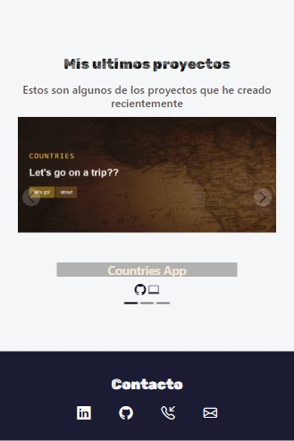

# Portafolio Adaptable (Responsive) con Bootstrap 5

Este proyecto creado para un curso publicado es un portfolio web responsive.

El propósito de este proyecto es aprender a utilizar el Frameeork Boostrap, y hacerlo mediante la creación de mi mi portafolio. Incluye una breve descripción de mi mismo y de los proyectos que realicé

### Capturas de pantalla:

**Pagina inicial**:

**Sobre mi**:

**Proyectos**:

